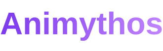

<p align="center">
  
</p>

<h3 align="center">
Animythos is both a component library and an interactive showcase. 
</h3>

<h3 align="center">
Each component has its own live demo, documentation, and example usage.
</h3>

<p align="center">
  
</p>

---

## Features

- Reusable Three.js animations
- Built with React Three Fiber
- Interactive component previews
- Individual documentation pages
- Central component registry
- Support for custom shaders and effects
- Designed to make adding new animations simple

---

## Tech Stack

- React
- TypeScript
- Vite
- Three.js
- React Three Fiber
- Drei
- React Router

---

## Project Structure

```text
src/
├── components/
│   └── Floating/
│       ├── Floating.tsx
│       └── index.ts
│
├── demos/
│   └── FloatingDemo.tsx
│
├── pages/
│   ├── HomePage.tsx
│   ├── ComponentsPage.tsx
│   └── ComponentPage.tsx
│
├── ui/
│
├── data/
│   └── components.ts
│
├── hooks/
│
└── shaders/
```

### `components`

Contains the reusable animations and effects that make up the Animythos library.

These components should not depend on the documentation website.

### `demos`

Contains scenes used to demonstrate library components.

A demo can contain cameras, lighting, objects, environments, controls, and other elements needed to showcase the component.

### `pages`

Contains the pages used by the showcase website.

### `ui`

Contains reusable UI components used by the website itself.

### `data`

Contains component metadata and the central component registry.

### `hooks`

Contains reusable React and Three.js hooks.

### `shaders`

Contains reusable GLSL shader code.

---

# Getting Started

Clone the repository:

```bash
git clone https://github.com/YOUR_USERNAME/animythos.git
```

Enter the project:

```bash
cd animythos
```

Install dependencies:

```bash
npm install
```

Start the development server:

```bash
npm run dev
```

The application will normally be available at:

```text
http://localhost:5173
```

---

# Adding a New Animation

Animations in Animythos consist of two main parts:

```text
Reusable component
        ↓
Demo
        ↓
Component registry
        ↓
Website
```

For example:

```text
Floating.tsx
    ↓
FloatingDemo.tsx
    ↓
components.ts
    ↓
/components/floating
```

## 1. Create the component

Create a new folder inside:

```text
src/components/
```

For example:

```text
src/components/Rotation/
```

Add the component:

```text
Rotation/
├── Rotation.tsx
└── index.ts
```

Example:

```tsx
import type { ReactNode } from "react";
import { useRef } from "react";
import { useFrame } from "@react-three/fiber";
import type { Group } from "three";

interface RotationProps {
  children: ReactNode;
  speed?: number;
}

function Rotation({
  children,
  speed = 1,
}: RotationProps) {
  const groupRef = useRef<Group>(null);

  useFrame((_, delta) => {
    if (!groupRef.current) return;

    groupRef.current.rotation.y += delta * speed;
  });

  return (
    <group ref={groupRef}>
      {children}
    </group>
  );
}

export default Rotation;
```

Export it from:

```text
src/components/Rotation/index.ts
```

```ts
export { default as Rotation } from "./Rotation";
```

---

## 2. Create a demo

Create a demo inside:

```text
src/demos/
```

For example:

```text
src/demos/RotationDemo.tsx
```

```tsx
import { Canvas } from "@react-three/fiber";
import { OrbitControls } from "@react-three/drei";

import { Rotation } from "../components/Rotation";

function RotationDemo() {
  return (
    <div style={{ width: "100%", height: "400px" }}>
      <Canvas camera={{ position: [0, 0, 4] }}>
        <ambientLight intensity={1.5} />

        <directionalLight
          position={[3, 3, 3]}
          intensity={2}
        />

        <Rotation speed={1}>
          <mesh>
            <boxGeometry />
            <meshStandardMaterial />
          </mesh>
        </Rotation>

        <OrbitControls />
      </Canvas>
    </div>
  );
}

export default RotationDemo;
```

The demo belongs to the website and should not contain reusable component logic.

---

## 3. Add the animation to the registry

The component registry is located at:

```text
src/data/components.ts
```

Import the new demo:

```ts
import RotationDemo from "../demos/RotationDemo";
```

Then add a registry entry:

```ts
{
  slug: "rotation",
  name: "Rotation",
  description: "Continuously rotates any 3D object.",
  category: "Animation",
  demo: RotationDemo,
}
```

The registry may then look like:

```ts
export const components: ComponentInfo[] = [
  {
    slug: "floating",
    name: "Floating",
    description: "Adds a smooth floating animation to any 3D object.",
    category: "Animation",
    demo: FloatingDemo,
  },
  {
    slug: "rotation",
    name: "Rotation",
    description: "Continuously rotates any 3D object.",
    category: "Animation",
    demo: RotationDemo,
  },
];
```

---

## 4. Test the component

Once registered, the component should automatically appear on:

```text
/components
```

Its individual page should become available at:

```text
/components/rotation
```

You should not need to modify `ComponentPage.tsx`.

---

# Component Registry

The component registry is the central source of truth for the showcase website.

Each entry currently follows this structure:

```ts
export interface ComponentInfo {
  slug: string;
  name: string;
  description: string;
  category: ComponentCategory;
  demo: ComponentType;
}
```

### `slug`

Used to generate the component URL.

```ts
slug: "particle-field"
```

becomes:

```text
/components/particle-field
```

### `name`

The displayed component name.

```ts
name: "Particle Field"
```

### `description`

A short explanation of what the component does.

### `category`

Used to organize components.

Current categories include:

```text
Animation
Particles
Shaders
Camera
Background
```

### `demo`

The React component used as the live preview.

```ts
demo: ParticleFieldDemo
```

---

# Component Design Guidelines

Components should be reusable rather than tied to one specific object.

Prefer:

```tsx
<Floating>
  <MyModel />
</Floating>
```

over:

```tsx
<FloatingCube />
```

Expose useful configuration through props:

```tsx
<Floating
  speed={2}
  amplitude={0.5}
>
  <MyModel />
</Floating>
```

Try to keep:

- reusable logic inside `components`
- showcase-specific logic inside `demos`
- website UI inside `ui`
- shared hooks inside `hooks`
- reusable shader code inside `shaders`

---

# README Animation

GitHub does not run React or Three.js directly inside README files.

The easiest way to show Animythos in motion is therefore an animated GIF.

Create:

```text
public/
└── readme/
    └── animythos-demo.gif
```

Then the README can display it with:

```html
<p align="center">
  
</p>
```

A good future GIF could quickly cycle through several components:

```text
Floating
    ↓
Particles
    ↓
Dissolve
    ↓
Shader effect
    ↓
Animythos
```

This gives visitors an immediate visual explanation of the project before they read the documentation.

---

## Status

Animythos is currently under development.

Initial focus:

- Build the component showcase
- Establish the reusable component architecture
- Add the first animation components
- Add usage and source-code documentation
- Expand into particles, shaders, camera effects, and backgrounds
